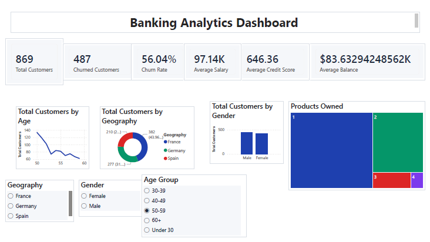
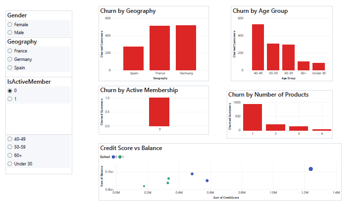
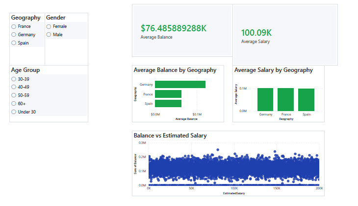
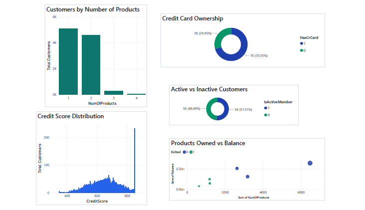
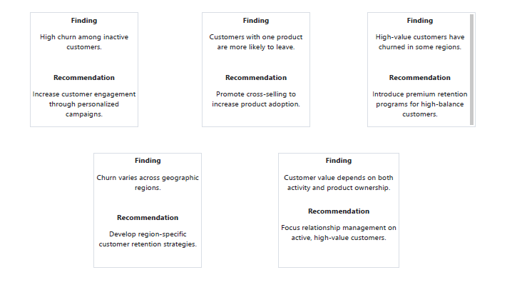

# Banking Customer Analytics

## Business Problem

A retail bank observed increasing customer churn and wanted to understand the factors influencing customer retention and profitability.

This project analyzes customer demographics, financial behavior, account activity, and product ownership to identify churn drivers and provide actionable recommendations for improving customer retention.

---

## Tech Stack

- Power BI
- SQL
- Python (Pandas)
- DAX
- Power Query
- Excel

---

## Dashboard Pages

### Executive Overview

- Customer KPIs
- Churn Rate
- Average Balance
- Average Credit Score
- Customer Distribution

---

### Customer Demographics

- Age Groups
- Gender
- Geography
- Tenure
- Product Ownership

---

### Churn Analysis

- Churn by Geography
- Churn by Age Group
- Churn by Active Membership
- Churn by Number of Products
- Credit Score vs Balance

---

### Financial Insights

- Average Balance
- Average Salary
- Balance by Geography
- Salary Distribution
- Customer Value

---

### Product & Customer Value

- Product Ownership
- Credit Card Usage
- Active Members
- Customer Value Analysis

---

### Executive Recommendations

Business recommendations to improve customer retention and profitability based on dashboard insights.

---

## Key Business Insights

- Inactive customers exhibit significantly higher churn than active customers.
- Customers with fewer banking products are more likely to leave.
- Customer churn varies across geographic regions.
- High-balance customers require targeted relationship management.
- Cross-selling additional products can improve customer retention.

---

## Business Recommendations

- Increase customer engagement for inactive customers.
- Develop region-specific retention strategies.
- Expand cross-selling initiatives.
- Prioritize retention of high-value customers.
- Launch targeted campaigns for high-risk customer segments.

---

## Repository Contents

- Power BI Dashboard (.pbix)
- Customer Churn Dataset (.csv)
- Custom Power BI Theme